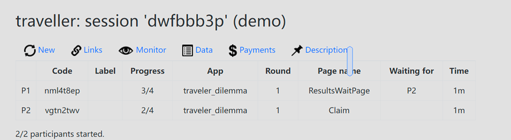

# Answers

### Question 1
Experimental economics aims to empirically test economic theories by observing decision-making processes in controlled environments, as noted by Smith (1982). oTree has emerged as a notably convenient tool for conducting such experiments, characterized by its modest demands on computational resources and straightforward approach to usage and deployment. In contrast to other RL environments I have deployed, the set-up process with oTree has been relatively trouble-free merely by following the guide lines provided(Zhang et al. 2021). As evidenced in the video (2021) provided in Ed., oTree offers flexibility in experiment design by allowing customization using HTML, CSS, JavaScript, and Python. Furthermore, its compatibility with any device with a web browser enhances accessibility and usability for both researchers and participants.

Nevertheless, despite its practicality, various challenges arouse while I was playing the games(Fig 1). 

*Fig. 1: The user interface of Otree trust game*
(generated by processon)

Pain Points in Behavioral Game Theory Research using oTree:

1. Limited Flexibility in Game Design in the form of GUI: oTree's framework offers a certain degree of flexibility in designing economic games, but it lacks the versatility required to implement complex game structures and dynamic decision-making environments efficiently. In deploying the trust game, I encountered constraints in customizing the game parameters to explore various trust levels comprehensively. Though there is the option for design in html,js,css, it is worth noting that not all researchers are equipped with relevant skills.

2. Data Management Challenges: Managing and analyzing data collected from experiments conducted via oTree can be cumbersome, especially in studies involving multiple treatments, repeated interactions, or intricate decision sequences. Exporting, cleaning, and analyzing data often require additional tools and manual intervention, leading to inefficiencies and potential errors.

Proposed Innovative Software Solution:

1. User friendly GUI: Could provide researchers with an intuitive interface equipped with drag-and-drop functionalities, similar to that of scratch, allowing for seamless customization of game structures, parameters, and decision paths. Researchers can easily design complex games with dynamic decision-making environments tailored to their specific research objectives.

2. Integrated Data Management and Analysis Tools: Could incorporates built-in data management and analysis features, streamlining the process of data collection, organization, and analysis. Researchers can efficiently export data in various formats, perform real-time analyses, and visualize results within the software interface, reducing reliance on external tools and minimizing potential errors.

*Fig. 2: Flowchat for Question 1*
### Question 2

*Fig. 3: Running the chess game on PettingZoo*

Multi-Agent Reinforcement Learning (MARL) presents a promising avenue for tackling complex decision-making scenarios involving multiple interacting agents. However, its application to real-world problems, such as playing international chess(fig 3), faces significant challenges. This report delves into the limitations of current MARL frameworks, focusing on environmental constraints and agent algorithm customizations, with insights drawn from the development process of a MARL agent for international chess.

Limitations of Current MARL Frameworks:

1. Environment Constraints: Traditional MARL frameworks often assume a fixed, deterministic environment, which doesn't accurately represent the stochastic and dynamic nature of real-world scenarios like chess. In chess, the state space is vast, and the actions of one agent directly influence the state transitions for others, making it challenging to model accurately. Traditional reinforcement learning methods like Q-learning and Policy Gradient methods face significant challenges when applied directly to multi-agent reinforcement learning (MARL) problems. These challenges include non-stationarity due to the dynamic interactions among agents, difficulties in credit assignment across multiple agents, complexities in balancing exploration and exploitation in the presence of other learning agents, and scalability issues in handling large state and action spaces. As a result, specialized MARL algorithms like MADDPG or centralized training with decentralized execution have been developed to address these challenges more effectively, offering improved performance and scalability in multi-agent environments compared to traditional single-agent methods.

2. Agent Algorithm Customizations: MARL algorithms often struggle with scalability and convergence issues, especially when dealing with large state spaces and complex interactions. Moreover, designing reward structures that incentivize collaborative behavior while preventing exploitation can be non-trivial.

Development Process of a MARL Agent for International Chess:

Definition of States: The state of the chessboard encapsulates the positions of all pieces for both players, along with additional information such as castling rights and en passant opportunities. Each agent observes the board from its perspective, requiring state representations tailored to individual viewpoints.( could include factors such as coordinates such as A3, and points for each piece e.g. 3p for a knight)

Actions: Agents select actions from a set of legal moves available for their pieces. However, the chosen action should consider the potential responses of the opponent, introducing a level of strategic complexity beyond individual move selection.

Rewards: Reward design is crucial for shaping agent behavior. In chess, one of the rewards could include immediate gains such as capturing opponent pieces or strategic advantages like controlling the center of the board. (However, this is a greedy policy and might hinder the AI player from deploying sacrificial moves which result in a better outcome.) Another reward could come from the wining of the game, with each step givenBalancing short-term gains with long-term strategic objectives is essential to foster cooperative play and discourage selfish actions. We could formulate a list of moves(e.g. e4, e5, Nf3, Nc6, Bb5, a6

) into a sequence (Wikipedia Contributors, 2019).

Proposed Solutions to Overcome Limitations:

1. Dynamic Environment Modeling: Incorporating techniques from adversarial training and generative modeling can enable MARL agents to adapt to the dynamic and stochastic nature of chess. Techniques like Monte Carlo Tree Search (MCTS) combined with deep reinforcement learning can enhance the agent's ability to explore and exploit the state space effectively.

2. Hierarchical Reinforcement Learning: Hierarchical approaches can alleviate scalability issues by decomposing the problem into manageable subtasks. For example, agents could learn high-level strategies such as controlling the center or executing specific opening moves, while lower-level policies handle individual piece movements.

3. Curriculum Learning: Gradually increasing the complexity of the training environment can help agents learn progressively more challenging strategies. Starting with simplified versions of the game and gradually introducing additional rules and complexities can improve the robustness and generalization of MARL agents.
   

*Fig. 4: The mind map of the answer to question two.*

### Question 3(Luo et al. 2023)
Summary of the Paper (Luo et al. 2023):

Core Research Questions: The paper addresses the challenge of designing an incentive mechanism for unbiased federated learning (FL) with randomized client participation. The primary research questions are: (1) How to design a practical incentive mechanism for FL with partial client participation to ensure convergence to a globally optimal unbiased model? (2) How to incentivize clients' active participation in FL by measuring their contribution to the model performance and designing an efficient payment strategy?

Methodologies: The authors propose a game-theoretic incentive mechanism where the server adopts a customized pricing strategy to motivate different clients to join with varying participation levels. They develop an adaptive model aggregation scheme to guarantee model unbiasedness and derive a new convergence bound that predicts how clients' participation levels and heterogeneous data affect model performance. The paper uses a non-convex optimization problem to analyze the Stackelberg Equilibrium (SE), revealing interesting payment design principles.

Application Scenarios: The paper discusses the application of the proposed mechanism in federated learning systems where clients and the server have different interests and where clients are heterogeneous in terms of data distribution and availability. The proposed solution aims to improve model performance for the server and increase profits for the clients in real-world federated learning deployments.

2. Critique of the Research Question:

The research questions are well-aligned with the challenges in federated learning, focusing on bias due to partial participation and the economic aspects of incentivizing clients. However, one could argue that the paper could also address the ethical and privacy implications of client participation in FL systems. Understanding how the proposed economic mechanisms interact with privacy concerns and ethical considerations could provide a more holistic approach to the problem.

3. Critique of the Methodology:

The assumptions made in the paper, such as clients being independent decision-makers and having complete information about their local data, may not hold in all practical scenarios. The methodology could be improved by incorporating Bayesian methods to handle incomplete information scenarios and by considering more realistic client behavior models that account for bounded rationality and strategic interactions.

4. Critique of the Application Scenario:

While the federated learning scenarios presented are relevant, the rapid advancement in technologies like blockchain and generative AI could offer new perspectives on addressing the challenges in FL. For instance, blockchain could be used to ensure transparent and secure client participation, while generative AI could help in generating synthetic data to balance the dataset across clients, thus reducing bias.

5. Beyond Computer Science and Economics:
Bounded rationality plays a significant role in how clients and servers might interact within the proposed system. If the study incorporated participants with specific psychological heuristics, the outcomes might differ, as clients may not always act rationally or in their best economic interest. Similarly, the inclusion of AI agents with different decision-making capabilities, such as ChatGPT, could lead to different dynamics in the FL system, potentially requiring adjustments in the incentive mechanisms to account for the unique behaviors and decision-making processes of AI participants.

Incorporating insights from bounded rationality into the analysis of federated learning (FL) incentive mechanisms could reveal that traditional economic assumptions of rational behavior may not fully capture real-world participant interactions. Human participants, influenced by cognitive biases and heuristics, may not always respond rationally to monetary incentives, while AI agents like ChatGPT may not optimize their participation as expected due to their own limitations and biases. This could necessitate redesigning incentives to accommodate the psychological and computational idiosyncrasies of participants, potentially leading to more nuanced and adaptive mechanisms. The paper's conclusions might shift towards advocating for a behavioral economics-based approach to FL incentive design, emphasizing the importance of understanding and leveraging the behavioral complexities of all participants involved. 

Chatgpt has responded to the question with the answers stated bellow.

*Fig. 5: Response of Chatgpt*

*Fig. 6: The mind map of the answer to question three.*

## Bibliography
tutorials, oTree. “oTree Tutorials Part 1: Introduction.” Youtube, 2021. https://www.youtube.com/watch?v=OzkFvVhoHr0&t=292s.

Luo, Bing, Yutong Feng, Shiqiang Wang, Jianwei Huang, and Leandros Tassiulas. 2023. “Incentive Mechanism Design for Unbiased Federated Learning with Randomized Client Participation.” ArXiv (Cornell University), April. https://doi.org/10.48550/arxiv.2304.07981.

Smith, Vernon L. 1982. "Microeconomic Systems as an Experimental Science." The American

Wikipedia Contributors. 2019. “Chess.” Wikipedia. Wikimedia Foundation. February 23, 2019. https://en.wikipedia.org/wiki/Chess.

Zhang, L. (Sunshine), Tian, X. (Michelle), Zhuang, Z., Zhang, L. (Sunshine), Tian, X. (Michelle), Wu, T. (Henry), … Zhuang, Z. (2022). oTree Instructions for Behavioral Experiments. In Autumn 2021. https://doi.org/10.21428/aa21bfc0.841ff112

*Figure 7: Screenshot of Grammarly*
