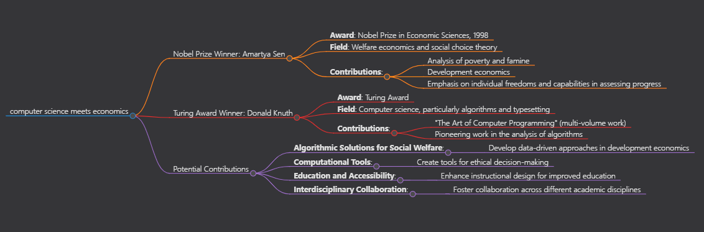
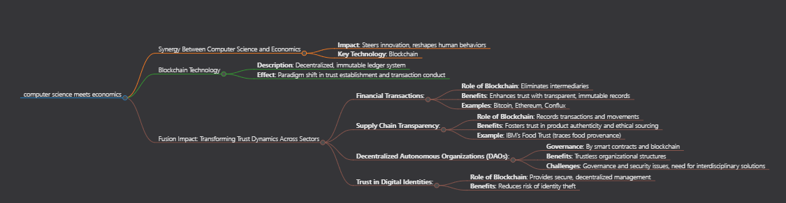
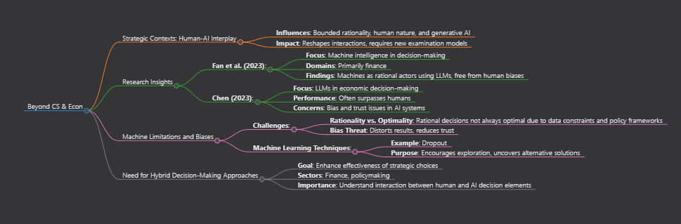
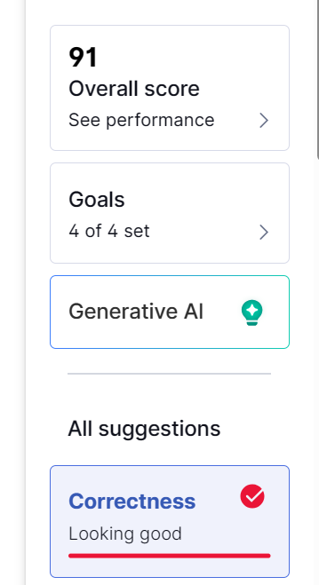

# Questions

### Qustion 1
**When computer science meets economics**: Who do you truly want to become? Pick one of your favorite Nobel Prize winners [(https://www.nobelprize.org/)](https://www.nobelprize.org/) and Turing Award winners [(https://amturing.acm.org/)](https://amturing.acm.org/). How do you want to contribute to the intersection of the two north stars to advance human civilizations?
### Question 2
**CS&Econ for a Better Future**: How do you perceive the synergy between computer science and economics as a catalyst for steering innovation toward a brighter future? Please present a foundational assertion, followed by multiple specific instances that support your claim, including a reference to a topic discussed at the colloquium on Friday, March 22.
### Question 3
**Beyond CS & Econ**: How are aspects of human nature, like bounded rationality, and pioneering technologies, such as generative AI, reshaping the dynamics between humans and AI agents in strategic contexts? Additionally, how might this interplay be perceived and conceptualized distinctively from current models? Address this inquiry by drawing upon the literature covered in our lectures and supplementary scholarly works, ensuring to include in-text citations and a comprehensive bibliography.

# Answers

### Question 1
One of my favorite Nobel Prize winners is Amartya Sen, who won the Nobel Prize in Economic Sciences in 1998 for his contributions to welfare economics and social choice theory. He's known for his work on poverty, famine, and development economics, emphasizing the importance of individual freedoms and capabilities in the measurement of economic and social progress. (“The Sveriges Riksbank Prize in Economic Sciences in Memory of Alfred Nobel 1998,” n.d.)

From the Turing Award winners, I'll choose Donald Knuth, a computer scientist known for his pioneering work in algorithms and typesetting. His contributions to the analysis of algorithms, particularly through his multi-volume work "The Art of Computer Programming," have had a profound impact on the field of computer science. (“Donald E. Knuth - A.M. Turing Award Laureate,” n.d.)

I could possibly contribute by developing algorithmic solutions for social welfare, leveraging data-driven approaches in development economics, creating computational tools for ethical decision-making, enhancing education and accessibility through innovative instructional design, and fostering interdisciplinary collaboration.

Fig.1 The mind map of my answer for question one.

### Question 2
The synergy between computer science and economics indeed acts as a potent force for steering innovation toward a brighter future, reshaping and redefining human behaviors. This is particularly evident in the emergence of Blockchain technology, a decentralized and immutable ledger system that presents a paradigm shift in how trust is established and transactions are conducted.

Blockchain intersects with economic principles to reshape various sectors and foster a more transparent and efficient ecosystem. Here's how this fusion of disciplines is transforming trust dynamics across sectors:

Trust in Financial Transactions:

Blockchain eliminates the need for intermediaries, enhancing trust by providing transparent and immutable transaction records. Cryptocurrencies like Bitcoin, Ethereum and Conflux demonstrate this shift towards peer-to-peer transactions.

Supply Chain Transparency:

By recording transactions and movements of goods, Blockchain creates transparent supply chains, fostering trust in product authenticity and ethical sourcing. IBM's Food Trust platform exemplifies this by tracing food provenance.

Decentralized Autonomous Organizations (DAOs):

Governed by smart contracts and blockchain technology, DAOs exemplify trustless organizational structures. While revolutionary, they pose governance and security challenges that require interdisciplinary collaboration.

Trust in Digital Identities:

Blockchain-based identity solutions offer secure and decentralized management of digital identities, reducing the risk of identity theft.

Fig.2 The mind map of my answer for question one.

### Question 3
In the realm of strategic contexts, the evolving interplay between humans and AI agents is deeply influenced by fundamental aspects of human nature, such as bounded rationality, and the emergence of pioneering technologies like generative AI. This dynamic reshaping of interactions prompts a nuanced examination, distinct from current models, regarding the roles and capabilities of both humans and machines.

Research by Fan et al. (2023) underscores the potential of machine intelligence in decision-making dynamics, particularly in domains like finance. Leveraging Large Language Models (LLMs), machines can operate as rational actors, free from the cognitive biases and emotional fluctuations inherent in human decision-making processes. These AI agents excel in navigating complexities, sidestepping issues like decision fatigue and social influence, thereby facilitating optimal choices within quantitative finance settings. Chen's (2023) investigations further corroborate this notion, showcasing LLMs' prowess in making rational economic decisions, often surpassing human performance across diverse domains.

Nevertheless, akin to their human counterparts, machines are encumbered by limitations. While rationality is a hallmark of machine decision-making, it does not always guarantee optimality. Factors such as data constraints and policy frameworks can constrain the efficacy of machine-driven decisions. Additionally, bias poses a significant threat, potentially distorting results and reducing the trustworthiness of AI systems (Chen, 2023）. Acknowledging this, contemporary machine learning involves techniques like dropout, designed to foster exploration and uncover alternative, potentially superior solutions under specific conditions.

Thus, there is a necessity for the development of hybrid decision-making approaches, enhancing the effectiveness of strategic choices in sectors like finance and policymaking. This merging emphasizes the importance of grasping the interaction between these decision-making elements.

Fig.3 The mind map of my answer for question one.
## Bibliography
Chen, Yiting, Tracy Xiao Liu, You Shan, and Songfa Zhong. 2023. “The Emergence of Economic Rationality of GPT.” Proceedings of the National Academy of Sciences of the United States of

America 120 (51). https://doi.org/10.1073/pnas.2316205120.

“Donald E. Knuth - A.M. Turing Award Laureate.” n.d. Amturing.acm.org. https://amturing.acm.org/award_winners/knuth_1013846.cfm.

Fan, Caoyun, Jindou Chen, Yaohui Jin, and Hao He. 2023. “Can Large Language Models Serve as Rational Players in Game Theory? A Systematic Analysis.” ArXiv.org. December 12,

2023. https://doi.org/10.48550/arXiv.2312.05488.

“The Sveriges Riksbank Prize in Economic Sciences in Memory of Alfred Nobel 1998.” n.d. NobelPrize.org. https://www.nobelprize.org/prizes/economic-sciences/1998/sen/facts/.

Fig.4 Screenshot of Grammarly
